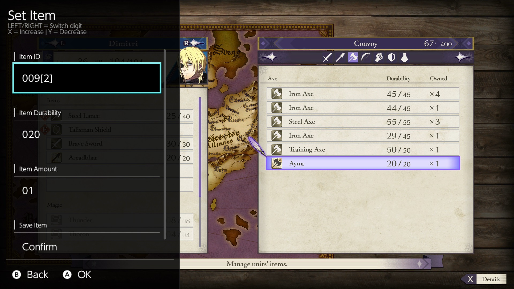

# Fire Emblem: Three Houses - Item Trainer
* This overlay allows the user to manually add or edit items in the Convoy using the ID assigned to that item.
* It also has shorcuts to set certain categories of items to x99 stock in the Convoy.

## Select Specific Item to Edit
* This will add the item to the Convoy if not owned already, or update the item if it exists already.
* When a new item is added, the Convoy amount number will increase, refresh the menu by scrolling to another tab and back to see the added item.
* An item in a unit's inventory counts as it not being in the Convoy.



### Item ID
* Set 4 digit ID for the item you want to add/edit.
* [Refer to the text file for a listing of all item IDs.](feth_item_ids.txt)
* Only weapons/equipment/item IDs should be used. Dishes/gambits/magic IDs will just take up a Convoy slot and not be visible in game.

### Item Durability
* All items have a durability count attached to them.
* Consumables can be set beyond their max, and a unit can carry that full stack. Useful for quickly eating Stat Boosters.
* Setting it to 100 can used to make weapons infinite use, this is normally applied for Equipment and Broken/Rusty weapons. For consumables, the number will decrease when using.
* Same items stack together in the Convoy depending on Durability. So to make sure Equipment (Rings, Shields, etc) stack properly, have the durability set to 100 for those.

### Item Amount
* This is how many of the item is to be made or edited to.

## Quick Edit Multiple Items
* This menu will quickly let you set certain item categories you already have in your Convoy to x99. With certain options toggable.
* To keep things "clean", leave the options to the defaults to only boost existing items to x99 when pressing each category.


### Items to Edit
```
Only Owned (Default)
Add ALL
```
* The default makes it so only items in the Convoy are affected.
* 'Add ALL' will force add any missing items for each category, but with a Side Effect mentioned next in Durability.

### Durability --> 100
```
Off (Default)
On
```
* Setting this to 'On' will make whatever you're updating to 100 Durability.
* When doing a batch edit with 'Add ALL' on, new items will be added at 100 Durability even if this is set to 'Off'.

### Amount --> 99
```
On (Default)
Off
```
* Setting this to 'Off" is only good for batch adding new items, which will make only x1 stock.

## The Quick Edit Buttons
* Pressing each category will update the items in the Convoy depending on the above options set.

**Potions**
```
1000 - Vulnerary
1001 - Concoction
1002 - Elixir
1011 - Antitoxin
1012 - Pure Water
```

**Exam Seals**
```
1003 - Intermediate Seal
1004 - Advanced Seal
1006 - Master Seal
1157 - Dark Seal
1158 - Beginner Seal
1159 - Abyssian Exam Pass
```

**Keys**
```
1013 - Door Key
1014 - Chest Key
1015 - Master Key
````

**Gold Bars**
```
1008 - Bullion
1009 - Large Bullion
1010 - Extra Large Bullion
```

**Stat Boosters**
```
1016 - Seraph Robe
1017 - Energy Drop
1018 - Spirit Dust
1019 - Secret Book
1020 - Speedwing
1021 - Goddess Icon
1022 - Giant Shell
1023 - Talisman
1024 - Black Pearl
1025 - Shoes of the Wind
1051 - Sacred Galewind Shoes
1052 - Sacred Floral Robe
1053 - Sacred Snowmelt Drop
1054 - Sacred Moonstone
1148 - Rocky Burdock
1149 - Premium Magic Herbs
1150 - Ailell Pomegranate
1151 - Speed Carrot
1152 - Miracle Bean
1153 - Ambrosia
1154 - White Verona
1155 - Golden Apple
1156 - Fruit of Life
```

**Anna Quest Item**
```
1161 - Trade Secret
```
